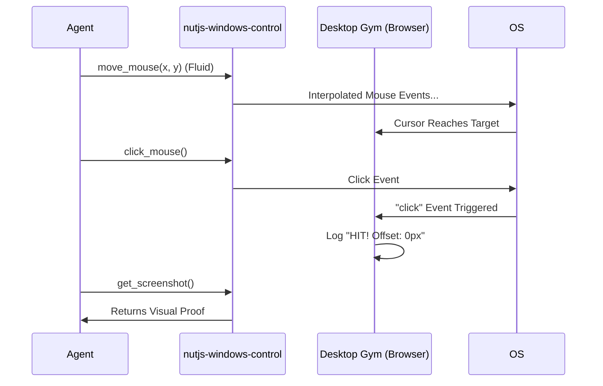

# Project "Fluidity": Desktop Automation Gym & Human-Like Inputs
> **Experiment ID:** 003-Rev2 | **Date:** 2025-12-16  
> **Status:** SUCCESS | **Focus:** Human-Like Input, Verification Sandboxes

## 1. Executive Summary
This report documents the successful refactoring of the `nutjs-windows-control` MCP server to achieve "Fluid Mouse Movement" and the establishment of "Desktop Gym," a web-based sandbox for verifying automation precision. 

**Key Achievements:**
- Eliminated robotic "teleportation" and "start-stop" cursor behavior.
- Implemented asynchronous linear interpolation for smooth, human-like motion.
- Created a reproducible "Gym" environment to validate targeting accuracy (0.0px offset verified).

---

## 2. The Problem: "The Robot in the Room"
Previous automation attempts utilizing direct coordinate jumps (`mouse.setPosition`) failed to interact reliably with complex UI elements (e.g., drag-and-drop operations). This was due to:
1.  **Teleportation:** Instant movement is flagged as "bot-like" by some OS heuristics and fails to trigger hover states effectively.
2.  **Start-Stop Jerkiness:** Sequential move-then-wait logic caused visible stuttering, breaking the "illusion of life" and failing fluid drag operations.
3.  **Verification Gap:** Testing on a live desktop (moving real files) is chaotic, risky, and lacks a definitive "Reward Signal" (did the file move, or did I miss?).

## 3. The Solution Part I: Fluid Mouse Algorithms
We refactored the `keysender` provider to implement **Interpolated Motion**:

### Algorithm
Instead of point A -> point B, we calculate a path:
`path = [p1, p2, ... pn]`
Where each point is a 10px step along the vector, separated by ~10-15ms delays.

**Code Snippet (Typescript):**
```typescript
private async fluidMove(to: MousePosition): Promise<void> {
    const steps = Math.max(Math.floor(distance / stepSize), 1);
    // ...
    for (let i = 1; i <= steps; i++) {
        // Linear Interpolation
        const t = i / steps;
        const curX = Math.round(from.x + dx * t);
        const curY = Math.round(from.y + dy * t);
        
        await this.mouse.moveTo(curX, curY);
        await new Promise(resolve => setTimeout(resolve, 10));
    }
}
```

**Result:** The cursor now "glides" across the screen, mimicking human hand movement and ensuring proper OS event triggering (mouseenter, mouseover).

---

## 4. The Solution Part II: The Desktop Gym (Sandbox)
To solve the "Verification Gap," we built the **Desktop Gym**.

### What is it?
A standalone HTML5 Web Application designed purely for agent calibration.
- **Controlled Environment:** High-contrast dark mode, no distractions.
- **Dynamic Targets:** Buttons that spawn at random coordinates.
- **Reward Signal:** Explicit "HIT" or "MISS" logs with pixel-perfect accuracy metrics.

### Why it works for GitHub/Open Sourcers?
By decoupling tests from the user's specific desktop icons (which move/change), we create a **Standardized Benchmark**.
*   "Agent A achieved 95% accuracy in the Gym."
*   "Agent B failed the moving target test."

**The Gym Interface:**
> `[Status Panel]` `[Log Console]`
> `[      (Target O)      ]`
> *A green flash indicates a confirmed hit.*

---

## 5. Technical Architecture
The system operates via the **Model Context Protocol (MCP)**:



---

## 6. Future Roadmap: "Antigravity Gym" for GitHub
To productize this experiment for the community, we propose:

### Phase 1: The "Gym" Package
Release the `index.html` as a hosted GitHub Page or a lightweight Electron app.
- **Feature:** "Calibration Mode" (Measures Browser Offset vs Screen Coordinates).
- **Feature:** "Speed Test" (Tracks mouse velocity and fluidity).

### Phase 2: AI Benchmark Suite
A rigid set of tasks for Agents to solve:
1.  **The Follower:** Keep mouse within a moving circle.
2.  **The Typer:** precise text entry into shifting input fields.
3.  **The Drag-Drop:** Move items from Bin A to Bin B.

### Phase 3: Headless Docker Container
Package the entire Windows/Desktop environment into a Docker container with `fluxbox` and `vnc`, pre-loaded with the Gym. This allows CI/CD testing of Desktop Agents without a physical monitor.

## 7. Conclusion
Experiment 003 proved that **Fluidity** and **Sanboxes** are the keys to reliable Desktop Automation. We have successfully upgraded our toolset from "Robotic Scripting" to "Agentic Interaction."
